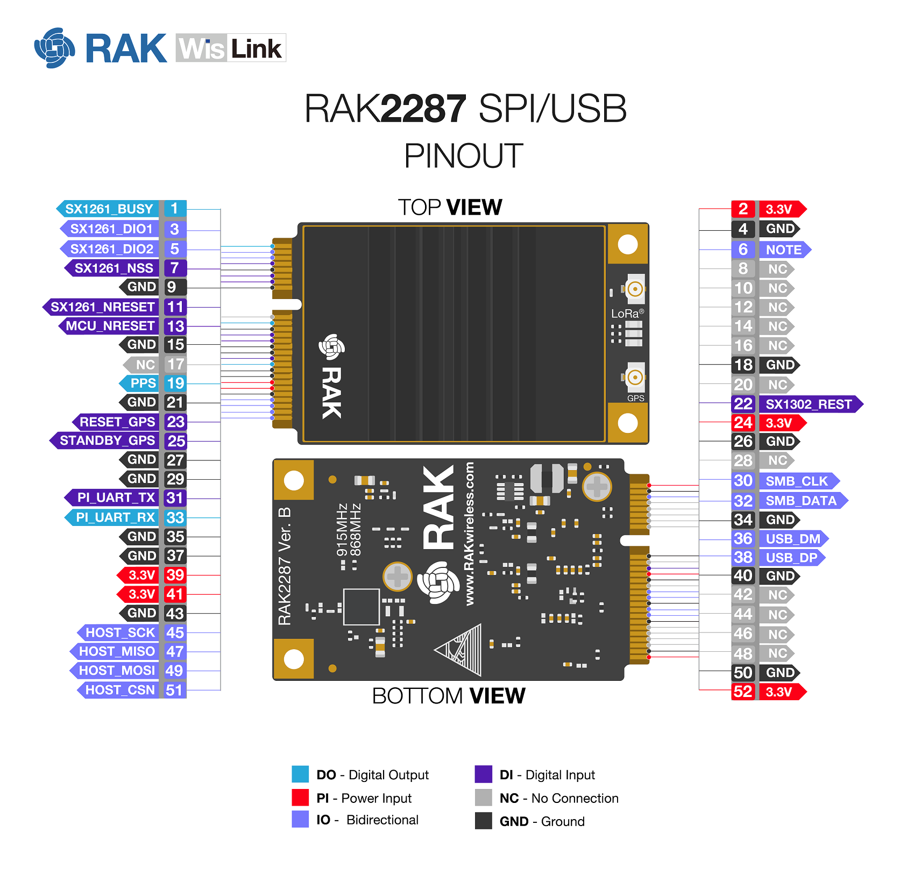
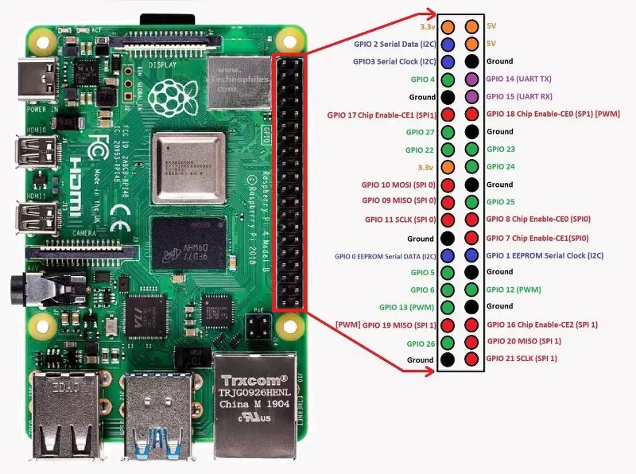

# Helium Miner Conversion

This project is a Rust-based framework for converting surplus Helium miners/hotspots into Hydrogen Plumbing LoRa gateways.

Supported hardare:
- RAK V2 (under development)
- SenseCAP M1 (planned)
- Bobcat 300 (under investigation)

### Notes for RAK V2 Hardware

**BOM:**

- Stock? Raspberry Pi 4b 
- RAK2287 (varriant without GPS or USB-SPI bridge) with SX1302 gateway with SPI interface
- RAK2004 Pi Hat ([custom board for Rak V2 miner](https://forum.rakwireless.com/t/pi-hats-rak2003-vs-rak2004/8257))
   - has some extra features for miner (e.g. EEPROM for Helium keys?)

**Wiring diagram:**

*Active RAK2287 pins:* SPI pins 45,47,49,51: wired to Pi SPI0 (GPIO pins 8,9,10,11)

*SX1302 Reset:* SX reset pin 22 bonded to pin 13 (MCU Reset), and weired throuhg RAK2004 to Pi GPIO pin 25

